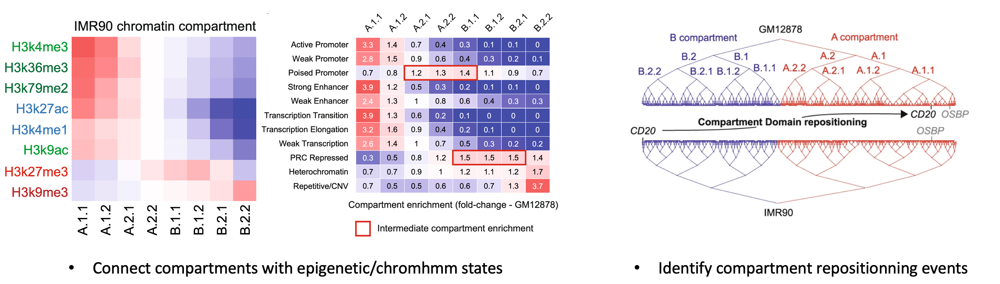

# CALDER user manual

CALDER is a Hi-C analysis tool that allows: (1) compute chromatin domains from whole chromosome contacts; (2) derive their non-linear hierarchical organization and obtain sub-compartments; (3) compute nested sub-domains within each chromatin domain from short-range contacts. CALDER is currently implemented in R.

* Overview of the CALDER method:


* Calder connects chromatin 3D organization to genomic function:



## Multiple new features were added in version 2.0

* Support for hg19, hg38, mm9, mm10 and other genomes
* Support input in .hic format generated by Juicer tools (https://github.com/aidenlab/juicer)
* Optimized bin_size selection for more reliable compartment identification
* Aggregated all chromosome output into a single file for easier visualization in IGV
* Added output in tabular .txt format at bin level for easier downstream analysis

Below we introduce two main updates:

### (1) Optimized `bin_size` selection

Due to reasons such as low data quality or large scale structural variation, compartments can be unreliably called at one `bin_size` (equivalent to `resolution` in the literature) but properly called at another `bin_size`. We added an optimized `bin_size` selection strategy to call reliable compartments. This strategy is based on the observation from our large scale compartment analysis (https://www.nature.com/articles/s41467-021-22666-3), that although compartments can change between different conditions, their overall correlation `cor(compartment_rank_1, compartment_rank_2)` is high (> 0.4).
<br>
<br>
**The strategy**: given a `bin_size` specified by user, we call compartments with extended `bin_sizes` and choose the smallest `bin_size` such that no bigger `bin_size` can increase the compartment correlation with a reference compartment more than 0.05. For example, if correlation for `bin_size=10000` is 0.2 while for `bin_size=50000` is 0.6, we are more confident that the latter is more reliable; if correlation for `bin_size=10000` is 0.5 while for `bin_size=50000` is 0.52, we would choose the former as it has higher resolution.
<br>
<br>
`bin_size` is extended in the following way thus contact matrices at any larger `bin_sizes` can be aggregated from the input contact matrices directly:
```
if(bin_size==5E3) bin_sizes = c(5E3, 10E3, 50E3, 100E3)
if(bin_size==10E3) bin_sizes = c(10E3, 50E3, 100E3)
if(bin_size==20E3) bin_sizes = c(20E3, 40E3, 100E3)
if(bin_size==25E3) bin_sizes = c(25E3, 50E3, 100E3)
if(bin_size==40E3) bin_sizes = c(40E3, 80E3)
if(bin_size==50E3) bin_sizes = c(50E3, 100E3)
```
Note that this strategy is currently only available for `hg19`, `hg38`, `mm9` and `mm10` genome for which we generated high quality reference compartments using Hi-C data from: GSE63525 for `hg19`, https://data.4dnucleome.org/files-processed/4DNFI1UEG1HD for `hg38`, GSM3959427 for `mm9`, http://hicfiles.s3.amazonaws.com/external/bonev/CN_mapq30.hic for `mm10`.

### (2) Support for other genomes

Although CALDER was mainly tested on human and mouse dataset, it can be applied to dataset from other genomes. One additional information is required in such case: a `feature_track` presumably positively correlated with compartment score (thus higher values in A than in B compartment). This information will be used for correctly determining the `A/B` direction. Some suggested tracks are gene density, H3K27ac, H3K4me1, H3K4me2, H3K4me3, H3K36me3 (or negative transform of H3K9me3) signals. Note that this information will not alter the hierarchical compartment/TAD structure, and can come from any external study with matched genome. An example of `feature_track` is given in the **Usage** section.

# Installation

## Make sure all dependencies have been installed:

* R.utils (>= 2.9.0),
* doParallel (>= 1.0.15),
* ape (>= 5.3),
* dendextend (>= 1.12.0),
* fitdistrplus (>= 1.0.14),
* igraph (>= 1.2.4.1),
* Matrix (>= 1.2.17),
* rARPACK (>= 0.11.0),
* factoextra (>= 1.0.5),
* maptools (>= 0.9.5),
* data.table (>= 1.12.2),
* fields (>= 9.8.3),
* GenomicRanges (>= 1.36.0)
* ggplot2 (>= 3.3.5)
* strawr (>= 0.0.9)

## Clone its repository and install it from source:

`git clone https://github.com/CSOgroup/CALDER.git`

`install.packages(path_to_CALDER, repos = NULL, type="source")` ## install from the cloned source file


Please contact yliueagle@googlemail.com for any questions about installation.

## install CALDER and dependencies automaticly:

```
if (!requireNamespace("BiocManager", quietly = TRUE))
    install.packages("BiocManager")

BiocManager::install("GenomicRanges")
install.packages("remotes")
remotes::install_github("CSOgroup/CALDER")
```

# Usage

CALDER contains three modules: (1) compute chromatin domains; (2) derive their hierarchical organization and obtain sub-compartments; (3) compute nested sub-domains within each compartment domain.

### Input data format

CALDER works on contact matrices compatible with that generated by Juicer tools (https://github.com/aidenlab/juicer), either a .hic file, or three-column `dump` table retrieved by the juicer dump (or straw) command (https://github.com/aidenlab/juicer/wiki/Data-Extraction):	

	16050000	16050000	10106.306
	16050000	16060000	2259.247
	16060000	16060000	7748.551
	16050000	16070000	1251.3663
	16060000	16070000	4456.1245
	16070000	16070000	4211.7393
	16050000	16080000	522.0705
	16060000	16080000	983.1761
	16070000	16080000	1996.749
	...

`feature_track` should be a data.frame or data.table of 4 columns (chr, start, end, score), and can be generated directly from conventional format such as bed or wig, see the example:

```
library(rtracklayer)
feature_track  = import('ENCFF934YOE.bigWig') ## from ENCODE https://www.encodeproject.org/files/ENCFF934YOE/@@download/ENCFF934YOE.bigWig
feature_track = data.table::as.data.table(feature_track)[, c(1:3, 6)]
```
	> feature_track
	chr	start	end	score
	chr1	534179	534353	2.80512
	chr1	534354	572399	0
	chr1	572400	572574	2.80512
	chr1	572575	628400	0
	...	...	...	...
	chrY	59031457	59032403	0
	chrY	59032404	59032413	0.92023
	chrY	59032414	59032415	0.96625
	chrY	59032416	59032456	0.92023
	chrY	59032457	59032578	0.78875

### Example usage (1): use contact matrix file in dump format as input
```
chrs = c(21:22)

## demo contact matrices in dump format
contact_file_dump = as.list(system.file("extdata", sprintf("mat_chr%s_10kb_ob.txt.gz", chrs),
			package='CALDER'))
names(contact_file_dump) = chrs

## Run CALDER to compute compartments but not nested sub-domains
CALDER(contact_file_dump=contact_file_dump, 
			chrs=chrs, 
			bin_size=10E3,
			genome='hg19',
			save_dir=save_dir,
			save_intermediate_data=FALSE,
			n_cores=2,
			sub_domains=FALSE)

## Run CALDER to compute compartments and nested sub-domains / will take more time
CALDER(contact_file_dump=contact_file_dump, 
			chrs=chrs, 
			bin_size=10E3,
			genome='hg19',
			save_dir=save_dir,
			save_intermediate_data=TRUE,
			n_cores=2,
			sub_domains=TRUE)
```

### Example (2): use contact matrices stored in an R list 
```
chrs = c(21:22)
contact_file_dump = as.list(system.file("extdata", sprintf("mat_chr%s_10kb_ob.txt.gz", chrs),
			package='CALDER'))
names(contact_file_dump) = chrs
contact_tab_dump = lapply(contact_file_dump, data.table::fread)


CALDER(contact_tab_dump=contact_tab_dump, 
			chrs=chrs, 
			bin_size=10E3,
			genome='hg19',
			save_dir=save_dir,
			save_intermediate_data=FALSE,
			n_cores=2,
			sub_domains=FALSE)
```

### Example (3): use .hic file as input
```
chrs = c(21:22)
hic_file = 'HMEC_combined_30.hic' ## can be downloaded from https://ftp.ncbi.nlm.nih.gov/geo/series/GSE63nnn/GSE63525/suppl/GSE63525_HMEC_combined_30.hic

CALDER(contact_file_hic=hic_file, 
			chrs=chrs, 
			bin_size=10E3,
			genome='hg19',
			save_dir=save_dir,
			save_intermediate_data=FALSE,
			n_cores=2,
			sub_domains=FALSE)
```

### Example (4): run CALDER on other genomes
```
## prepare feature_track
library(rtracklayer)
feature_track_raw  = import('ENCFF934YOE.bigWig') ## from ENCODE https://www.encodeproject.org/files/ENCFF934YOE/@@download/ENCFF934YOE.bigWig
feature_track = data.table::as.data.table(feature_track_raw)[, c(1:3, 6)]

## Run CALDER
chrs = c(21:22)
contact_file_dump = as.list(system.file("extdata", sprintf("mat_chr%s_10kb_ob.txt.gz", chrs),
			package='CALDER'))
names(contact_file_dump) = chrs

CALDER(contact_file_dump=contact_file_dump, 
			chrs=chrs, 
			bin_size=10E3,
			genome=others,
			save_dir=save_dir,
			feature_track=feature_track,
			save_intermediate_data=FALSE,
			n_cores=2,
			sub_domains=FALSE)
```


### Parameters:

| Name              | Description |  
| --------------------- | ----------------------- |
| **chrs**                | A vector of chromosome names to be analyzed, with or without 'chr'. Chromosome names should be consistent with those in `contact_file_hic` and `feature_track` if such files are provided
| **contact_file_dump**                |A list of contact files in dump format, named by `chrs`. Each contact file stores the contact information of the corresponding `chr`. Only one of `contact_file_dump`, `contact_tab_dump`, `contact_file_hic` should be provided
| **contact_tab_dump**                | A list of contact table in dump format, named by `chrs`, stored as an R object. Only one of `contact_file_dump`, `contact_tab_dump`, `contact_file_hic` should be provided
| **contact_file_hic**                | A hic file generated by Juicer tools. It should contain all chromosomes in `chrs`. Only one of `contact_file_dump`, `contact_tab_dump`, `contact_file_hic` should be provided
| **genome**                | One of 'hg19', 'hg38', 'mm9', 'mm10', 'others' (default). These compartments will be used as reference compartments for optimized bin_size selection. If `genome = others`, a `feature_track` should be provided (see below) and no optimized bin_size selection will be performed 
| **save_dir**             | the directory to be created for saving outputs
| **bin_size**         | The bin_size (resolution) to run CALDER. `bin_size` should be consistent with the data resolution in `contact_file_dump` or `contact_tab_dump` if these files are provided as input, otherwise `bin_size` should exist in `contact_file_hic`. Recommended `bin_size` is between **10000 to 100000**
| **single_binsize_only**     |  logical. If TRUE, CALDER will compute compartments only using the bin_size specified by the user and not do bin size optimization
| **feature_track**                | A genomic feature track in `data.frame` or `data.table` format. This track will be used for determining the A/B compartment direction when `genome=others` and should presumably have higher values in A than in B compartment. Some suggested tracks can be gene density, H3K27ac, H3K4me1, H3K4me2, H3K4me3, H3K36me3 (or negative transform of H3K9me3 signals)
| **save_intermediate_data**  | logical. If TRUE, an intermediate_data will be saved. This file can be used for computing nested sub-domains later on
| **n_cores**     |  integer. Number of cores to be registered for running CALDER in parallel
| **sub_domains**     |  logical, whether to compute nested sub-domains


## Output Structure
The output of the workflow is stored in the folder specified by `save_dir` and will look like this:
```
save_dir/
|-- sub_domains
|   `-- all_nested_boundaries.bed
|-- sub_compartments
|   |-- cor_with_ref.txt
|   |-- cor_with_ref.pdf
|   |-- cor_with_ref.ALL.txt
|   |-- all_sub_compartments.tsv
|   `-- all_sub_compartments.bed
`-- intermediate_data
    |-- sub_domains
    |   |-- chr22_sub_domains_log.txt
    |   |-- chr22_nested_boundaries.bed
    |   |-- chr21_sub_domains_log.txt
    |   `-- chr21_nested_boundaries.bed
    `-- sub_compartments
        |-- 50kb
        |   |-- chr22_sub_compartments.bed
        |   |-- chr22_log.txt
        |   |-- chr22_domain_hierachy.tsv
        |   |-- chr22_domain_boundaries.bed
        |   |-- chr21_sub_compartments.bed
        |   |-- chr21_log.txt
        |   |-- chr21_domain_hierachy.tsv
        |   `-- chr21_domain_boundaries.bed
        |-- 10kb
        |   |-- chr22_sub_compartments.bed
        |   |-- chr22_log.txt
        |   |-- chr22_intermediate_data.Rds
        |   |-- chr22_domain_hierachy.tsv
        |   |-- chr22_domain_boundaries.bed
        |   |-- chr21_sub_compartments.bed
        |   |-- chr21_log.txt
        |   |-- chr21_intermediate_data.Rds
        |   |-- chr21_domain_hierachy.tsv
        |   `-- chr21_domain_boundaries.bed
        `-- 100kb
            |-- chr22_sub_compartments.bed
            |-- chr22_log.txt
            |-- chr22_domain_hierachy.tsv
            |-- chr22_domain_boundaries.bed
            |-- chr21_sub_compartments.bed
            |-- chr21_log.txt
            |-- chr21_domain_hierachy.tsv
            `-- chr21_domain_boundaries.bed
```

### File description:

* The `sub_domains` folder stores the nested boundaries
* The `sub_compartments` folder stores the optimal compartment information, including files:

| Name              | Description |  
| --------------------- | ----------------------- |
| **all_sub_compartments.bed**                | a .bed file containing the optimal compartments for all `chrs`, that can be visualized in IGV. Different colors were used to distinguish compartments (at the resolution of 8 sub-compartments)
| **all_sub_compartments.tsv**                | optimal compartments stored in tabular text format. Each row represents one 10kb region
| **cor_with_ref.ALL.txt**                | a plot of correlation between compartment rank and the reference compartment rank for each of extended `bin_sizes`, and the optimal `bin_size` that is finally selected
| **cor_with_ref.pdf**                | correlation of compartment rank with the reference compartment rank using the optimal `bin_size`


* The `intermediate_data` folder stores information at each of the extended `bin_sizes` for each chromosome


| Name              | Description |  
| --------------------- | ----------------------- |
| **chrxx_domain_hierachy.tsv**                | information of compartment domain and their hierarchical organization. The hierarchical structure is fully represented by `compartment_label`, for example, `B.2.2.2` and `B.2.2.1` are two sub-branches of `B.2.2`. The `pos_end` column specifies all compartment domain borders, except when it is marked as `gap`, which indicates it is the border of a gap chromosome region that has too few contacts and was excluded from the analysis (e.g., due to low mappability, deletion, technique flaw) 
| **chrxx_sub_compartments.bed**                | a .bed file containing the compartment information, that can be visualized in IGV. Different colors were used to distinguish compartments (at the resolution of 8 sub-compartments)
| **chrxx_domain_boundaries.bed**                | a .bed file containing the chromatin domains boundaries, that can be visualized in IGV
| **chrxx_nested_boundaries.bed**                | a .bed file containing the nested sub-domain boundaries, that can be visualized in IGV
| **chrxx_intermediate_data.Rds**                | an Rds file storing the intermediate_data that can be used to compute nested sub-domains
| **chrxx_log.txt, chrxx_sub_domains_log.txt**                | log files storing the status and running time of each step


All .bed files can be view directly through IGV:


## Running time:
For the computational requirement, running CALDER on the GM12878 Hi-C dataset at bin size of 40kb took **36 minutes** to derive the chromatin domains and their hierarchy for all chromosomes (i.e., CALDER Step1 and Step2); **13 minutes** to derive the nested sub-domains (i.e., CALDER Step3). At the bin size of 10kb, it took **1 h 44 minutes and 55 minutes** correspondingly (server information: 40 cores, 64GB Ram, Intel(R) Xeon(R) Silver 4210 CPU @ 2.20GHz). The evaluation was done using a single core although CALDER can be run in a parallel manner.

# Citation

If you use CALDER in your work, please cite: https://www.nature.com/articles/s41467-021-22666-3


# Contact information

* Author: Yuanlong LIU
* Affiliation: Computational Systems Oncology group, Department of Computational Biology, University of Lausanne, Switzerland
* Email: yliueagle@googlemail.com
